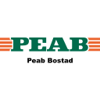
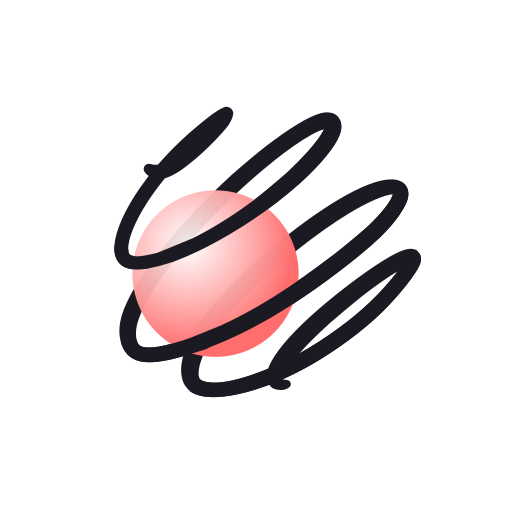
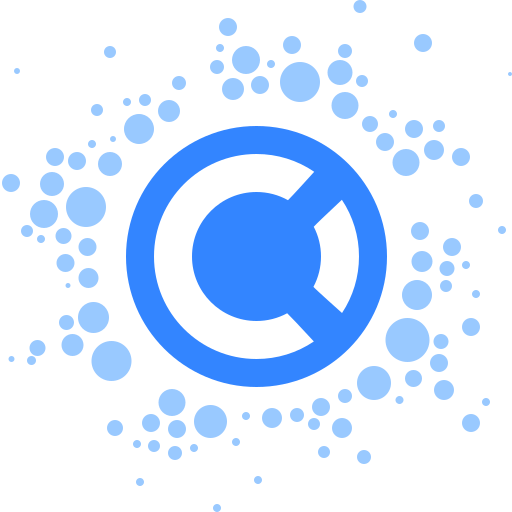

# **"EloB"**, System Architect & Full-Stack Engineer

Lorem about me

## Table of contents

- [Quick start](#quick-start)
- [Status](#status)
- [What's included](#whats-included)
- [Bugs and feature requests](#bugs-and-feature-requests)
- [Documentation](#documentation)
- [Tech stack](#tech-stack)
- [Contributing](#contributing)
- [Community](#community)
- [Versioning](#versioning)
- [Quotes](#quotes)
- [Creators](#creators)
- [Thanks-to](#thanks-to)
- [Copyright and license](#copyright-and-license)

## Quickstart

```javascript
(async () => {
  const fullStackEngineer = new contract({
    name: "Olle Bröms",
    born: 383356800,
    expertise: ["Node", "Javascript", ""],
  });

  fullStackEngineer.beginNewJourney();

  do {
    await fullStackEngineer.contactEducation();
  } while (fullStackEngineer.isSearchingForContract);

  fullStackEngineer.makeAmazingSoftware();
})();
```

### Install

```bash
mail -s "Reconnect after I saw your Github" olle.broms@ewebbyran.se
```

"Dear Olle, %0D%0A Found your Github profile and would very much like to talk to you about a work opportunity we think you might match with"

```bash
open "mailto:olle.broms@ewebbyran.se?subject=Reconnect after I saw your Github.&body=Dear Olle, %0D%0A Found your Github profile and would very much like to talk to you about a work opportunity we think you might match with"
```

## Status

## What's included

```text
EloB
│
├── 🤓 Private
│		├── 🐣 1986.born
│		├── 💾 1990.got.amiga500+
│		├── 🤼 1992.start.wrestling
│		├── ⌨️ 1991.start.demoing
│		├── 🏀 1995.start.handboll
│		├── 🖥️ 1994.got.486intellmmx
│		└── 🌐 1995.first.lanparty
│
├── 🏫 School
│		├── 🎓 2002.graduate.primaryschool
│		└── 🎓 2005.graduate.highschool
│
└── 💼 Career
		├── 👨‍💻 2007.webDeveloper.tablefinder
		├── 👨‍💻 2007.itEnginneer.sahlgrenskaUniversityHospital
        ├── 👨‍💻 2007.webDeveloper.foreverLivingProducts
		├── 👨‍💻 2009.webDeveloper.lokalNytt
		└── 👔 2010.CTO.ewebbyrån
```

## Bugs & feature requests

### Known bugs

- [ ] Highly Opinionated
- [ ] Sometimes being a toxic perfectionist which results that I push deadlines

### Feature requests

- [ ] Meditate more often & longer
- [ ] Be kinder to myself
- [ ] Exercise more

## Track record

### Brands

These are some of the brands I've worked with during my years.

| <a href="https://www.volvocars.com/"><p style="text-align: center;">Volvo</p></a>                                        | <a href="https://www.na-kd.com/"><p style="text-align: center;">NA-KD</p></a>                                          | <a href="https://beta.znipe.tv/"><p style="text-align: center;">Znipe</p></a>                                          | <a href="https://www.cryptzone.com/"><p style="text-align: center;">Cryptzone</p></a>                                          |
| ------------------------------------------------------------------------------------------------------------------------ | ---------------------------------------------------------------------------------------------------------------------- | ---------------------------------------------------------------------------------------------------------------------- | ------------------------------------------------------------------------------------------------------------------------------ |
| <a href="https://www.volvocars.com/"></a> | <a href="https://www.na-kd.com/"></a> | <a href="https://beta.znipe.tv/"></a> | <a href="https://www.cryptzone.com/"></a> |

| <a href="https://peabbostad.se/"><p style="text-align: center;">Volvo</p></a>                                             | <a href="https://www.maginepro.com/"><p style="text-align: center;">Magine</p></a>                                               | <a href="https://www.tele2.se/"><p style="text-align: center;">Tele2</p></a>                                          | <a href="https://www.rebtel.com/"><p style="text-align: center;">Rebtel</p></a>                                           |
| ------------------------------------------------------------------------------------------------------------------------- | -------------------------------------------------------------------------------------------------------------------------------- | --------------------------------------------------------------------------------------------------------------------- | ------------------------------------------------------------------------------------------------------------------------- |
| <a href="https://peabbostad.se/"></a> | <a href="https://www.maginepro.com/"></a> | <a href="https://www.tele2.se/"></a> | <a href="https://www.rebtel.com/"></a> |

| <a href="https://www.caterpillar.com/"><p style="text-align: center;">Caterpillar</p></a>                                              | <a href="https://www.mrgreen.com/"><p style="text-align: center;">Mr Green</p></a>                                             | <a href="https://www.vasttrafik.se/"><p style="text-align: center;">Västtrafik</p></a>                                               | <a href="https://www.knowit.se/"><p style="text-align: center;">Knowit</p></a>                                           |
| -------------------------------------------------------------------------------------------------------------------------------------- | ------------------------------------------------------------------------------------------------------------------------------ | ------------------------------------------------------------------------------------------------------------------------------------ | ------------------------------------------------------------------------------------------------------------------------ |
| <a href="https://www.caterpillar.com/"></a> | <a href="https://www.mrgreen.com/"></a> | <a href="https://www.vasttrafik.se/"></a> | <a href="https://www.knowit.se/"></a> |

## Tech stack

Technology I love and use in my daily life.

| Avatar                                                                                                                | Name                                                                  | Category           | Default | Year | Skill level         |
| --------------------------------------------------------------------------------------------------------------------- | --------------------------------------------------------------------- | ------------------ | ------- | ---- | ------------------- |
|                          | [Apple Macbook Pro](https://www.apple.com/macbook-pro/)               | Hardware           | TRUE    |      | ▓▓▓▓▓▓▓▓▓▓▓▓░░░ 81% |
|                             | [Apple Mac OSX](https://www.apple.com/macos/)                         | Operating System   | TRUE    |      | ▓▓▓▓▓▓▓▓▓▓▓▓░░░ 81% |
|  | [Microsoft Windows](https://www.microsoft.com/en-us/windows)          | Operating System   |         |      | ▓▓▓▓▓▓▓▓▓▓▓▓░░░ 81% |
|                      | [Linux](https://www.linux.org/)                                       | Operating System   |         |      | ▓▓▓▓▓▓▓▓▓▓▓▓░░░ 81% |
|                            | [Bash](https://www.gnu.org/software/bash/)                            | Operating System   |         |      | ▓▓▓▓▓▓▓▓▓▓▓▓░░░ 81% |
|                          | [Figma](https://figma.com/)                                           | Web design         | TRUE    |      | ▓▓▓▓▓▓▓▓▓▓▓▓░░░ 81% |
|                        | [Sketch](https://www.apple.com/)                                      | Web design         |         |      | ▓▓▓▓▓▓▓▓▓▓▓▓░░░ 81% |
|                         | [HTML5](http://www.w3.org/TR/html5/)                                  | Markup Language    | TRUE    |      | ▓▓▓▓▓▓▓▓▓▓▓▓░░░ 81% |
|                           | [CSS3](http://www.w3.org/TR/CSS/)                                     | Styling Language   | TRUE    |      | ▓▓▓▓▓▓▓▓▓▓▓▓░░░ 81% |
|                | [Javascript](https://developer.mozilla.org/en-US/docs/Web/JavaScript) | Language           | TRUE    |      | ▓▓▓▓▓▓▓▓▓▓▓▓░░░ 81% |
|                  | [NodeJS](https://nodejs.org/en/)                                      | Operating System   | TRUE    |      | ▓▓▓▓▓▓▓▓▓▓▓▓░░░ 81% |
|                                                  | [NVM](https://github.com/nvm-sh/nvm)                                  | Operating System   | TRUE    |      | ▓▓▓▓▓▓▓▓▓▓▓▓░░░ 81% |
|                                                             | [Oh-My-Zsh](https://ohmyz.sh/)                                        | Operating System   | TRUE    |      | ▓▓▓▓▓▓▓▓▓▓▓▓░░░ 81% |
|                                    | [Homebrew](https://brew.sh)                                           | Package Manager    | TRUE    |      | ▓▓▓▓▓▓▓▓▓▓▓▓░░░ 81% |
|                       | [NPMJS](https://www.npmjs.com)                                        | Package Manager    | TRUE    |      | ▓▓▓▓▓▓▓▓▓▓▓▓░░░ 81% |
|                            | [Yarn](https://yarnpkg.com/)                                          | Package Manager    |         |      | ▓▓▓▓▓▓▓▓▓▓▓▓░░░ 81% |
|                 | [Chrome](https://www.google.com/chrome/)                              | Web browser        |         |      | ▓▓▓▓▓▓▓▓▓▓▓▓░░░ 81% |
|                          | [Brave](https://brave.com/)                                           | Web browser        |         |      | ▓▓▓▓▓▓▓▓▓▓▓▓░░░ 81% |
|                  | [Safari](https://www.apple.com/safari/)                               | Web browser        | TRUE    |      | ▓▓▓▓▓▓▓▓▓▓▓▓░░░ 81% |
|                                           | [Tor Project](https://www.torproject.org/)                            | Web browser        |         |      | ▓▓▓▓▓▓▓▓▓▓▓▓░░░ 81% |
|              | [Mozilla Firefox](https://www.mozilla.org/en-US/firefox/)             | Web browser        |         |      | ▓▓▓▓▓▓▓▓▓▓▓▓░░░ 81% |
|                        | [ReactJS](https://reactjs.org/)                                       | JavaScript lib     |         |      | ▓▓▓▓▓▓▓▓▓▓▓▓░░░ 81% |
|                            | [React Spring](https://www.react-spring.io/)                          | Animations lib     |         |      | ▓▓▓▓▓▓▓▓▓▓▓▓░░░ 81% |
|                            | [VueJS](https://vuejs.org/)                                           | JavaScript lib     |         |      | ▓▓▓▓▓▓▓▓▓▓▓▓░░░ 81% |
|                      | [GatsbyJS](https://www.gatsbyjs.com/)                                 | Site Generator     |         |      | ▓▓▓▓▓▓▓▓▓▓▓▓░░░ 81% |
|           | [StorybookJS](https://storybook.js.org/)                              | UI documentation   |         |      | ▓▓▓▓▓▓▓▓▓▓▓▓░░░ 81% |
|             | [Chromatic](https://www.chromatic.com/)                               | UI feedback        |         |      | ▓▓▓▓▓▓▓▓▓▓▓▓░░░ 81% |
|                       | [Styled-Components](https://styled-components.com/)                   | Styling            |         |      | ▓▓▓▓▓▓▓▓▓▓▓▓░░░ 81% |
|                   | [Docker](https://www.docker.com/)                                     | Virtualization     |         |      | ▓▓▓▓▓▓▓▓▓▓▓▓░░░ 81% |
|                | [Docker](https://www.docker.com/)                                     | Virtualization     |         |      | ▓▓▓▓▓▓▓▓▓▓▓▓░░░ 81% |
|                 | [StrapiJS](https://strapi.io/)                                        | CMS                | TRUE    |      | ▓▓▓▓▓▓▓▓▓▓▓▓░░░ 81% |
|             | [Wordpress](https://www.wordpress.com/)                               | CMS                |         |      | ▓▓▓▓▓▓▓▓▓▓▓▓░░░ 81% |
|                   | [Drupal](https://www.drupal.org/)                                     | CMS                |         |      | ▓▓▓▓▓▓▓▓▓▓▓▓░░░ 81% |
|              | [Material-UI](https://material-ui.com/)                               | Frontend framework |         |      | ▓▓▓▓▓▓▓▓▓▓▓▓░░░ 81% |
|                  | [Bootstrap](https://getbootstrap.com/)                                | Frontend framework |         |      | ▓▓▓▓▓▓▓▓▓▓▓▓░░░ 81% |
|                          | [Bulma](https://bulma.io/)                                            | Frontend framework |         |      | ▓▓▓▓▓▓▓▓▓▓▓▓░░░ 81% |
|         | [Tailwind CSS](https://tailwindcss.com/)                              | Frontend framework |         |      | ▓▓▓▓▓▓▓▓▓▓▓▓░░░ 81% |
|                     | [PostgreSQL](https://www.postgresql.org/)                             | Database           | TRUE    |      | ▓▓▓▓▓▓▓▓▓▓▓▓░░░ 81% |
|                 | [MariaDB](https://mariadb.org/)                                       | Database           |         |      | ▓▓▓▓▓▓▓▓▓▓▓▓░░░ 81% |
|                          | [MySQL](https://www.mysql.com/)                                       | Database           |         |      | ▓▓▓▓▓▓▓▓▓▓▓▓░░░ 81% |
|                      | [MongoDB](https://www.mongodb.com/)                                   | Database           |         |      | ▓▓▓▓▓▓▓▓▓▓▓▓░░░ 81% |
|                         | [Git](https://git-scm.com/)                                           | Repository         |         |      | ▓▓▓▓▓▓▓▓▓▓▓▓░░░ 81% |
|                  | [Bitbucket](https://bitbucket.org/)                                   | Repository         |         |      | ▓▓▓▓▓▓▓▓▓▓▓▓░░░ 81% |
|                        | [Github](https://www.gitbhub.com/)                                    | Repository         | TRUE    |      | ▓▓▓▓▓▓▓▓▓▓▓▓░░░ 81% |
|                           | [Netlify](https://www.netlify.com/)                                   | Hosting            |         |      | ▓▓▓▓▓▓▓▓▓▓▓▓░░░ 81% |
|                   | [Heroku](https://www.heroku.com/)                                     | Hosting            |         |      | ▓▓▓▓▓▓▓▓▓▓▓▓░░░ 81% |
|                             | [ESLint](https://eslint.org/)                                         | Hosting            | TRUE    |      | ▓▓▓▓▓▓▓▓▓▓▓▓░░░ 81% |
|                        | [BabelJS](https://babeljs.io/)                                        | Hosting            |         |      | ▓▓▓▓▓▓▓▓▓▓▓▓░░░ 81% |
|                                 | [Editor Config](https://editorconfig.org/)                            | Hosting            |         |      | ▓▓▓▓▓▓▓▓▓▓▓▓░░░ 81% |
|                                               | [Husky](https://typicode.github.io/husky/#/)                          | Hosting            |         |      | ▓▓▓▓▓▓▓▓▓▓▓▓░░░ 81% |
|                    | [Prettier](https://prettier.io/)                                      | Hosting            |         |      | ▓▓▓▓▓▓▓▓▓▓▓▓░░░ 81% |
|                                     | [Commitlint](https://commitlint.js.org/)                              | Lint               | TRUE    |      | ▓▓▓▓▓▓▓▓▓▓▓▓░░░ 81% |
|                                | [Commitizen](http://commitizen.github.io/cz-cli/)                     | Hosting            | TRUE    |      | ▓▓▓▓▓▓▓▓▓▓▓▓░░░ 81% |
|                         | [Semantic-Release](https://semantic-release.gitbook.io/)              | Hosting            | TRUE    |      | ▓▓▓▓▓▓▓▓▓▓▓▓░░░ 81% |
|                                     | [Schema.org](https://schema.org/)                                     | Data structure     | TRUE    |      | ▓▓▓▓▓▓▓▓▓▓▓▓░░░ 81% |
|                        | [Trello](https://trello.com/)                                         | Webapp             |         |      | ▓▓▓▓▓▓▓▓▓▓▓▓░░░ 81% |
|                        | [Zapier](https://zapier.com/)                                         | Webapp             |         |      | ▓▓▓▓▓▓▓▓▓▓▓▓░░░ 81% |
|                      | [Hubspot](https://hubspot.com/)                                       | Webapp             |         |      | ▓▓▓▓▓▓▓▓▓▓▓▓░░░ 81% |
|                    | [Markdown](https://daringfireball.net/projects/markdown/)             | Webapp             | TRUE    |      | ▓▓▓▓▓▓▓▓▓▓▓▓░░░ 81% |
|            | [Browserslist](https://github.com/browserslist/browserslist)          | Webapp             | TRUE    |      | ▓▓▓▓▓▓▓▓▓▓▓▓░░░ 81% |

## Contributing

If you want to contribute to me, my life, my learning experience, you can connect on these social media and let's book IRL or video meeting:

| <a href="https://github.com/EloB"><p style="text-align: center;">Github</p></a>                                    | <a href="https://www.facebook.com/olle.broms1"><p style="text-align: center;">Facebook</p></a>                                      | <a href="https://www.instagram.com/bromso/"><p style="text-align: center;">Instagram</p></a>                                       | <a href="https://www.linkedin.com/in/olle-br%C3%B6ms-b186a524/"><p style="text-align: center;">LinkedIn</p></a>                                      | <a href="https://twitter.com/ollebroms"><p style="text-align: center;">Twitter</p></a>                                     | <a href="mailto:olle.broms@ewebbyran.se"><p style="text-align: center;">Email</p></a>                               |
| ------------------------------------------------------------------------------------------------------------------ | ----------------------------------------------------------------------------------------------------------------------------------- | ---------------------------------------------------------------------------------------------------------------------------------- | ---------------------------------------------------------------------------------------------------------------------------------------------------- | -------------------------------------------------------------------------------------------------------------------------- | ------------------------------------------------------------------------------------------------------------------- |
| <a href="https://github.com/EloB"></a> | <a href="https://www.facebook.com/olle.broms1"></a> | <a href="https://www.instagram.com/bromso/"></a> | <a href="https://www.linkedin.com/in/olle-br%C3%B6ms-b186a524/"></a> | <a href="https://twitter.com/ollebroms"></a> | <a href="mailto:olle.broms@ewebbyran.se"> |

## Quotes

> ##### **"The meaning of life is to find you gift.**
>
> ##### **The purpose of life is to give it away"**
>
> ###### _Unknown_

> ##### **"On my business card, I am a Creative Director.**
>
> ##### **In my mind, I am a designer.**
>
> ##### **But in my heart, I am a gamer"**
>
> ###### _Saturo Iwata, former CEO of Nintendo_

> ##### **"Si vis pacem, para bellum"**
>
> ##### **"If you want peace, prepare for war"**
>
> ###### _Publius Flavius Vegetius Renatus's_

## Creators

| Avatar                                  | Name   | Role   |
| --------------------------------------- | ------ | ------ |
|  | Ingrid | Mother |
|   | Tommy  | Father |

## Thanks to

| Avatar                                      | Name     | Role          |
| ------------------------------------------- | -------- | ------------- |
|        | Jonas    | Brother       |
|  | Viktoria | Brothers Wife |
